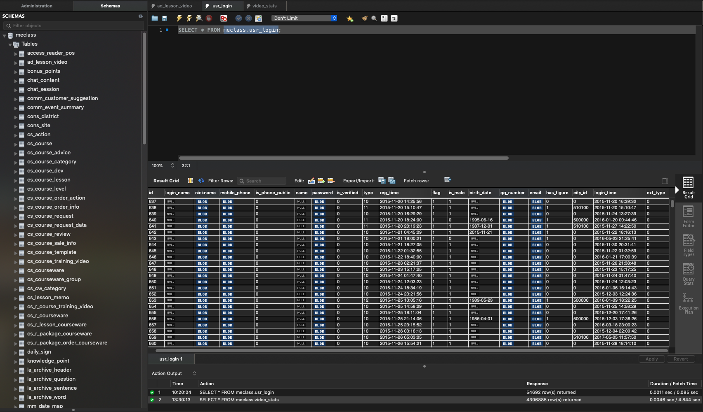
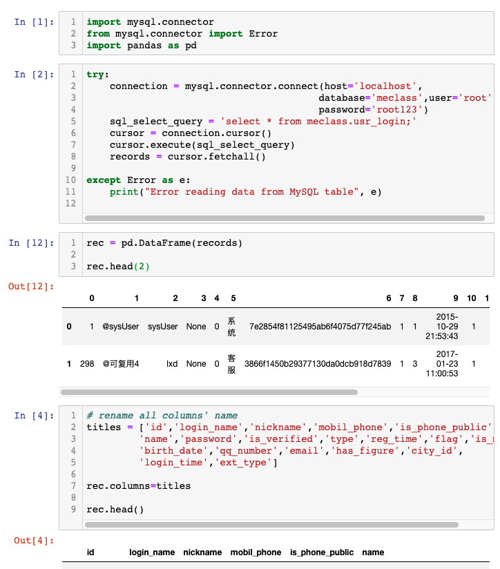

## Source Code:
The data for this project comes from my previous company, Linguapal, a short video based English learning platform. Data accumulated from 2017-2019, contains information regarding users and videos. 

Users are Chinese English learners from all provinces. Videos are considered as our contents and products. Some of them serve a purpose of attracting traffic. We brand them as Entertaining videos. Some of them are produce by content makers including ourselves, serving a purpose of making profit.

## Data Selecting 
My Linguapal dataset,“full_data.sql”, contains 1.5GB of data within 130 tables. Some tables are irrelevant to my project. My ideal data should be helping me depict either our users or our products(videos).

**A glimpse of the mysql database**

 

**An example of moving data from Mysql to Jupyter Notebook**

Do the same process for all 130 tables in order to pick up the datasets I need

[This is example of how data are selected](https://github.com/paxton615/Linguapal-Analysis/blob/master/data_dictionary_and_sources/Python_Mysql_Connector.ipynb)

## Data Dictionary
18 tables are selected for further EDA and analysis:

* video_stats : There are 4 million entries and 9 columns. Columns such as video_id, play_duration, play_times, together they can tell me the real popularity of each video.
* wx_usr_login_account: 54421 rows and 19 columns. Dataset includes usr_id, sex, province, last_login_time etc. They can give us a perfect depiction of our users.
* words_video_favorite: 45255 rows and 4 columns. The table contains the counts of each video been favorited by users.
* words_video_comment: 253048 rows and 3 columns. It contains comments towards each video. It can help identify popular videos and active users. Potentially, Nature Language Process can be used on this dataset in order to get some new findings. 
* words_video_comment_reply: users comment on previous comments. It's highly correlated to "words_video_comment".
* words_video_comment_praise: keeps counts of how many likes each comment gets.
* subscribed_video_package: shows how many users did subscribe on certain content package.
* r_word_video: shows how many times did the app's "review words function" be used.
* pmsg_bind_account: shows the OS system of each user's device. It may help us find out that whether IOS users are more willingly to spend money than android users.
* pay_recharge_log: contains the number of actual paying users.
* mobilephone_stats: contains users' phone numbers, register time and whereabouts. It is an another good dataset for depict user portrait. 
* daily_sign: tells the total sign in days of each user. 
* ad_lesson_video: 14537 rows and 13 columns. It gives comprehensive descriptions for each video, including the duration, title, real_access_times, real_favorite_times, author_id and so on.
